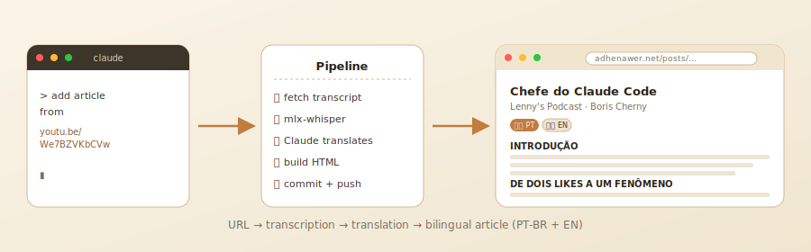

# video-to-text

[](https://opensource.org/licenses/MIT)
[](https://github.com/adhenawer/video-to-text/releases)
[](https://adhenawer.net/)
[](https://www.python.org/)
[](https://github.com/ml-explore/mlx)
[](https://workers.cloudflare.com/)
[](https://adhenawer.net/en/)
[](https://adhenawer.net/)

> 🇧🇷 **[Leia em português brasileiro](README-pt_br.md)** · 🇺🇸 You are reading in English

Turns YouTube and Twitter/X videos and podcasts into readable posts — organized by sections and published as static HTML.

<p align="center">
  
</p>

---

## Why

Long-form video is hard to skim, quote, search, or reread. This project turns videos into structured articles you can actually read.

- **Local transcription** via Whisper — no API cost for audio
- **LLM-organized** into thematic sections — not a chronological wall of text
- **Bilingual** out of the box — PT-BR and English with `hreflang` alternates
- **Agent-friendly** — Cloudflare Worker on free tier serves Markdown to AI crawlers via content negotiation (75% fewer tokens than HTML)
- **Zero frontend build** — static HTML deployable to GitHub Pages

Live at [adhenawer.net](https://adhenawer.net/) · [Blog](https://adhenawer.net/blog/)

---

## How it works

The pipeline auto-detects the provider from the URL and uses the right strategy to fetch the transcript:

```
Video URL (YouTube, Twitter/X)
    ↓
src/providers/               — detect provider, capture transcript
  ├── youtube.py                 — captions via youtube-transcript-api
  └── twitter.py                 — audio via yt-dlp → transcription via mlx-whisper
    ↓
Claude (translation)             — translates to PT-BR, strips timestamps/ads/noise,
                                   organizes into thematic sections
    ↓
src/build_html.py            — generates HTML with the project's design system
    ↓
index.html                       — card added to the index with description + progress
    ↓
Published article                — accessible locally or via GitHub Pages
```

The site publishes both languages: original (English for most videos) and Brazilian Portuguese. A Cloudflare Worker serves Markdown on demand for AI agents via content negotiation — see the [Markdown for Agents](#markdown-for-agents-cloudflare-worker) section below.

---

## Multi-provider architecture

The system uses a provider abstraction in `src/providers/` that supports different video sources. Each provider implements:

| Method | Description |
|--------|-------------|
| `detect(url)` | Returns `True` if the provider recognizes the URL |
| `extract_id(url)` | Extracts the unique video/tweet ID |
| `fetch_transcript(url)` | Returns text with timestamps in the standard format |

### Available providers

| Provider | Source | Strategy |
|----------|--------|----------|
| **YouTube** | `youtube.com`, `youtu.be` | Captions via `youtube-transcript-api` |
| **Twitter/X** | `x.com`, `twitter.com` | Audio download via `yt-dlp` + local transcription via `mlx-whisper` (Apple Silicon) |

To add a new provider (e.g. Vimeo), create a new module in `src/providers/` and register it in `__init__.py`.

---

## Stack

| Layer | Technology |
|-------|------------|
| Interface | [Hermes](https://github.com/NousResearch/hermes-agent) — agent via WhatsApp/CLI |
| Model | Claude (Anthropic) via Hermes |
| Transcription (YouTube) | [youtube-transcript-api](https://github.com/jdepoix/youtube-transcript-api) |
| Transcription (Twitter/X) | [yt-dlp](https://github.com/yt-dlp/yt-dlp) + [mlx-whisper](https://github.com/ml-explore/mlx-examples) |
| Translation / organization | Claude (LLM) or Gemma 4 local (mlx-lm) |
| Build | `src/build_html.py` — pure Python, no external dependencies |
| Frontend | Static HTML — zero frameworks, zero build steps, now also serves markdown (via Cloudflare Worker) |
| Hosting | GitHub Pages or any static server |
| Edge / Agents | Cloudflare Worker (Free plan) — converts HTML→Markdown at runtime via content negotiation |

---

## Full setup

> **Note on agents**: this project used to run inside external agents (OpenCode/Hermes) sending the pipeline over WhatsApp. Anthropic has since blocked subscription tokens from being reused by third-party agents, so the workflow now runs **directly inside [Claude Code](https://claude.com/claude-code)** — the official Anthropic CLI. You drive the pipeline by chatting with Claude Code in your terminal; it edits files, runs commands and pushes to git on your behalf.

### 1. Install Claude Code

```bash
# macOS / Linux / WSL2
curl -fsSL https://claude.ai/install.sh | bash

# Alternatively, via npm (any OS)
npm install -g @anthropic-ai/claude-code
```

Run `claude` in any directory to start the agent. First run will prompt you to sign in with your Anthropic account (subscription or API key).

### 2. Clone and install Python deps

```bash
git clone https://github.com/<YOUR-USERNAME>/video-to-text
cd video-to-text
python3 -m venv .venv && source .venv/bin/activate   # macOS/Linux
# .venv\Scripts\activate                              # Windows PowerShell
pip install -r requirements.txt
```

`requirements.txt` includes `youtube-transcript-api`, `yt-dlp`, `mlx-whisper`, `mlx-vlm` and others.

### 3. Install Whisper hardware dependencies

Whisper runs **locally** — no API calls, no external cost. Requirements differ by hardware:

#### Apple Silicon (macOS, recommended)

Uses [`mlx-whisper`](https://github.com/ml-explore/mlx-examples/tree/main/whisper) — MLX framework natively optimized for M1/M2/M3/M4 chips.

```bash
# ffmpeg is needed by yt-dlp to demux audio
brew install ffmpeg

# mlx-whisper already installed via requirements.txt
# Model (~1.5GB) is auto-downloaded on first run:
#   mlx-community/whisper-large-v3-turbo
```

Recommended: M1 Pro 16GB or higher. Transcription runs at ~5× real-time speed.

#### Windows (CPU or CUDA GPU)

`mlx-whisper` is Apple-only. On Windows, swap to [`faster-whisper`](https://github.com/SYSTRAN/faster-whisper) (CTranslate2-based):

```powershell
# Install ffmpeg (PowerShell as admin)
winget install Gyan.FFmpeg

# In your venv
pip uninstall mlx-whisper mlx-vlm mlx-lm -y
pip install faster-whisper

# If you have an NVIDIA GPU, install CUDA-enabled PyTorch for speed:
pip install torch --index-url https://download.pytorch.org/whl/cu121
```

You'll need to tweak `src/providers/twitter.py` to call `faster_whisper.WhisperModel` instead of `mlx_whisper.transcribe`. Claude Code can do this patch in a few seconds — ask it: *"Swap mlx-whisper for faster-whisper in src/providers/twitter.py, same interface."*

GPU: NVIDIA 8GB+ VRAM for the `large-v3` model, or use `medium`/`small` for CPU-only.

#### Linux (CPU or CUDA)

Same as Windows — use `faster-whisper`. Install `ffmpeg` via your package manager (`apt install ffmpeg` / `dnf install ffmpeg`).

### 4. Run the local server

```bash
python3 -m http.server 8080
# http://localhost:8080
# Local network (phone): http://<YOUR-LOCAL-IP>:8080
```

---

## Detailed agentic flow (inside Claude Code)

This is the exact flow I use daily. You open the project in Claude Code (`claude` in the repo root) and drive everything through chat.

### macOS example

**1. Start Claude Code in the repo**

```bash
cd ~/code/video-to-text
claude
```

**2. Ask Claude Code to process a video**

```
> add article from https://youtu.be/owmJyKVu5f8
```

Claude Code then, on its own:

- Runs `python3 src/fetch_transcript.py 'https://youtu.be/owmJyKVu5f8' --text-only --timestamps > /tmp/transcript_owmJyKVu5f8.txt`
- Reads the transcript, translates to PT-BR and organizes into thematic sections, writing `/tmp/owmJyKVu5f8_pt.txt`
- Calls `python3 src/build_html.py owmJyKVu5f8 'Title' 'Source' 'URL' /tmp/owmJyKVu5f8_pt.txt docs/posts/pt_br/SLUG.html`
- Edits `docs/index.html` to add a card
- Updates `docs/sitemap.xml` and `docs/llms.txt`
- `git add`, `git commit`, `git push`

You review the diff inside Claude Code. If anything looks off, ask it to fix.

### Windows example

Open PowerShell, activate the venv, start Claude Code:

```powershell
cd C:\code\video-to-text
.venv\Scripts\activate
claude
```

Same conversation as above. For Twitter/X videos, make sure you've done the `faster-whisper` swap from the setup section — Claude Code can do this transparently when it sees the Windows environment.

### Twitter/X flow

```
> transcribe https://x.com/user/status/1234567890
```

Under the hood:

- `yt-dlp` downloads the audio to `/tmp/`
- `mlx-whisper` (macOS) or `faster-whisper` (Windows/Linux) transcribes locally
- Same translation + HTML generation path as YouTube

### Full project docs

> See [CLAUDE.md](CLAUDE.md) for the full project knowledge base Claude Code uses to navigate the codebase.

---

## Markdown for Agents (Cloudflare Worker)

The site serves regular HTML for humans and **automatic Markdown** for AI agents performing *content negotiation* via `Accept: text/markdown`. Inspired by Cloudflare's [Markdown for Agents](https://blog.cloudflare.com/markdown-for-agents/) feature — which is only available on paid plans — this project implements the same idea using **Cloudflare Workers on the Free plan**.

### Why it matters

An article HTML on this site costs ~53,000 tokens for an agent to read (markup, nav, scripts, CSS). The Markdown version of the same content consumes **~13,000 tokens — 75% less**. Agents save context, cost and latency.

### How it works

```
Human (Accept: text/html)
  → Cloudflare edge → GitHub Pages → full HTML

Agent (Accept: text/markdown)
  → Cloudflare edge → Worker intercepts → fetch HTML → convert → Markdown
```

The Worker runs at Cloudflare's edge (~10ms latency), consumes the HTML from origin (GitHub Pages) and returns clean Markdown with YAML frontmatter containing metadata.

### Quick test

```bash
# Normal HTML (human)
curl -sI https://adhenawer.net/posts/original/head-claude-code-happens-after-coding-solved.html | grep -i content-type
# content-type: text/html; charset=utf-8

# Markdown (agent)
curl -s https://adhenawer.net/posts/original/head-claude-code-happens-after-coding-solved.html \
  -H "Accept: text/markdown" | head -15
# ---
# title: "The Head of Claude Code on What Happens After Coding Is Solved"
# author: "Lenny's Podcast with Boris Cherny ..."
# description: "..."
# source: "https://adhenawer.net/..."
# lang: en
# ---
#
# ## THE PROGRAMMER WHO NO LONGER WRITES CODE
#
# 100% of my code is written by Claude Code...
```

Worker response headers:

| Header | Value |
|---|---|
| `Content-Type` | `text/markdown; charset=utf-8` |
| `x-markdown-tokens` | Token estimate for the returned Markdown |
| `Vary` | `Accept` (for correct caching) |
| `Cache-Control` | `public, max-age=3600` |

### Technical implementation

Location: `workers/markdown-agent/`

```
workers/markdown-agent/
├── wrangler.toml       ← Worker routes and config
├── package.json
└── src/
    └── index.js        ← logic: detect Accept → fetch HTML → convert → return
```

**Registered routes** (`wrangler.toml`):

```toml
routes = [
  { pattern = "adhenawer.net/posts/*", zone_name = "adhenawer.net" },
  { pattern = "adhenawer.net/en/*", zone_name = "adhenawer.net" },
  { pattern = "adhenawer.net/leituras/*", zone_name = "adhenawer.net" },
  { pattern = "adhenawer.net/index.html", zone_name = "adhenawer.net" },
  { pattern = "adhenawer.net/llms.txt", zone_name = "adhenawer.net" }
]
```

**Worker flow** (`src/index.js`, summary):

The HTML→Markdown conversion is done with pure regex (no external dependencies) because the project's HTMLs have predictable structure (`<article>` wrapping `<h2>`, `<p>`, `<section>`, `<figure class="slide-figure">`). This avoids Turndown/JSDOM, which don't run natively in the Workers runtime.

### Cost

**Zero.** Cloudflare Workers' Free plan offers **100,000 requests/day at no cost**. More than enough for a static site with moderate agent traffic.

### Deploy

```bash
cd workers/markdown-agent
npm install
npx wrangler login          # first time only
npx wrangler deploy
```

### References

- Cloudflare blog post: [Markdown for Agents](https://blog.cloudflare.com/markdown-for-agents/)
- Feature docs (paid): [developers.cloudflare.com/fundamentals/reference/markdown-for-agents](https://developers.cloudflare.com/fundamentals/reference/markdown-for-agents/)

---

## Reading features

- **3 themes**: ☀️ Sepia (default, Kindle-style) · 🌤️ Light · 🌙 Dark
- **Per-device progress** — each device saves its own reading position
- **Auto-resume** — "continue where you left off" banner on reopen
- **Progress bar** and reading % pinned while scrolling
- **Clickable TOC** with all sections
- Mobile-responsive

---

## Articles

The full article index lives at [adhenawer.net](https://adhenawer.net/) (PT-BR) and [adhenawer.net/en/](https://adhenawer.net/en/) (English).
