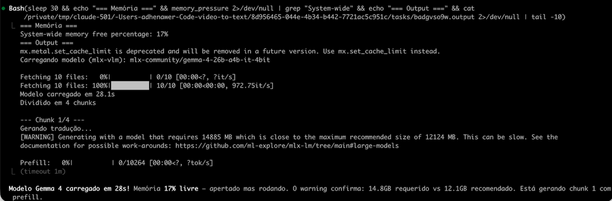
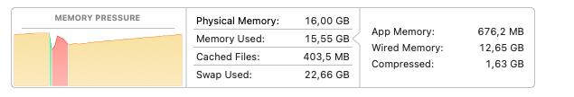

# Benchmark: Gemma 4 E4B 8bit vs Claude Opus 4.6

**Data:** 2026-04-05
**Vídeo fonte:** [De IDEs para Agentes de IA — Steve Yegge (Sourcegraph Podcast)](https://youtu.be/aFsAOu2bgFk)
**Transcrição:** 20.562 palavras (inglês)

## Setup

| | Claude Opus 4.6 | Gemma 4 E4B 8bit |
|---|---|---|
| **Execução** | API Anthropic (cloud) | Local, Mac M1 Pro 16GB |
| **Modelo** | claude-opus-4-6 | mlx-community/gemma-4-e4b-it-8bit |
| **Tamanho** | N/A (cloud) | ~8GB |
| **Framework** | Anthropic API | mlx-vlm 0.4.4 |
| **Tempo total** | ~2min | ~5min |
| **Chunking** | Não (contexto 200K) | 4 chunks de ~5-8K palavras |

## Output

| | Claude Opus 4.6 | Gemma 4 E4B 8bit |
|---|---|---|
| **Seções (h2)** | 7 | 9 |
| **Parágrafos** | 34 | 106 |
| **Palavras geradas** | ~3.200 | ~3.300 |
| **Seções fantasma** | 0 | ~20 (sub-seções em MAIÚSCULO renderizadas como `
`) |
| **HTML gerado** | artigo limpo | artefatos de markdown (listas `* **Nível:**`) |

## Critérios de avaliação (0-10)

| Critério | Descrição |
|----------|-----------|
| **Fidelidade** | Conteúdo fiel ao original, sem inventar informação |
| **Fluência PT-BR** | Naturalidade do português brasileiro |
| **Organização** | Qualidade das seções temáticas (agrupamento lógico, não cronológico) |
| **Concisão** | Elimina redundâncias, vai direto ao ponto |
| **Formato** | Conformidade com o template (separadores, headings, sem artefatos) |
| **Legibilidade** | Parágrafos bem dimensionados, fáceis de consumir no celular |
| **Cobertura** | Quanto do conteúdo relevante do vídeo foi capturado |

## Pontuação

| Critério | Claude Opus 4.6 | Gemma 4 E4B | Notas |
|----------|:---:|:---:|---|
| Fidelidade | 9 | 7 | Gemma erra o nome: "Steve Yagi" em vez de "Steve Yegge" |
| Fluência PT-BR | 10 | 7 | Gemma repete estruturas ("Ele observou...", "Ele argumentou...", "Ele concluiu...") |
| Organização | 9 | 6 | Claude: 7 seções claras. Gemma: 9 no TOC + ~20 sub-seções soltas no corpo |
| Concisão | 9 | 5 | Gemma repete "efeito vampiro" em 3 locais diferentes do artigo |
| Formato | 10 | 6 | Gemma gera listas markdown que renderizam como texto plano no HTML |
| Legibilidade | 9 | 6 | Claude: parágrafos 3-5 linhas. Gemma: alterna entre 1 linha e blocos densos |
| Cobertura | 8 | 8 | Empate — ambos cobrem os temas principais |
| **Total** | **64/70** | **45/70** | |

## Problemas específicos do Gemma 4 E4B

1. **Nome errado** — "Steve Yagi" consistente no artigo inteiro (nome correto: Steve Yegge)
2. **Sub-seções fantasma** — O modelo gera separadores `====` para sub-seções que o `build_html.py` não reconhece como headings (ficam como parágrafos em MAIÚSCULO)
3. **Markdown no output** — Listas `* **Nível 1:**` que deveriam ser texto corrido aparecem como markdown cru no HTML
4. **Repetição entre chunks** — Mesmo tema abordado em chunks diferentes resulta em conteúdo duplicado (efeito vampiro, captura de valor, inovação em grandes empresas)
5. **Construções robotizadas** — Parágrafos consecutivos começando com "Ele observou que...", "Ele argumentou que...", "Ele concluiu que..."

## Evidências de hardware

### Tentativa com Gemma 4 26B-A4B (OOM)

A primeira tentativa com o modelo `gemma-4-26b-a4b-it-4bit` (~15GB) carregou em 28s mas falhou com OOM no Metal GPU ao iniciar a inferência. O warning do mlx confirma: modelo requer 14.885 MB, máximo recomendado 12.124 MB.

### Gemma 4 E4B 8bit (no limite)

O Gemma 4 E4B 8bit operou no limite absoluto do hardware durante a inferência:

| Métrica | Valor |
|---------|-------|
| Physical Memory | 16,00 GB |
| Memory Used | 15,55 GB (97%) |
| Cached Files | 403,5 MB |
| Swap Used | 22,66 GB |
| App Memory | 676,2 MB |
| Wired Memory | 12,65 GB |
| Compressed | 1,63 GB |

O sistema usou **22,66 GB de swap** para compensar a falta de RAM — o modelo de ~8GB somado ao KV cache da inferência ultrapassa os 16GB físicos. O Memory Pressure ficou na zona vermelha. A máquina permaneceu estável mas com performance degradada (swap em SSD do M1 Pro é rápido, mas não substitui RAM).

## Conclusão

O Claude Opus 4.6 produz artigos de qualidade editorial — texto natural, zero erros factuais em nomes, organização limpa, sem repetição. Lê como um artigo escrito por jornalista.

O Gemma 4 E4B 8bit produz conteúdo utilizável mas com problemas claros que exigiriam revisão humana ou pós-processamento para atingir o padrão dos artigos existentes. Para uso pessoal com revisão rápida é aceitável; para publicação direta, o Claude é significativamente superior.

Do ponto de vista de hardware, o modelo E4B 8bit é o limite prático para um Mac M1 Pro 16GB — funciona, mas com swap pesado. Modelos maiores (26B, 31B) dão OOM fatal no Metal GPU.

## Arquivos de referência

- Claude Opus 4.6: `posts/pt_br/de-ides-para-agentes-de-ia-steve-yegge.html`
- Gemma 4 E4B: `posts/pt_br/teste-gemma4-pipeline.html`
- Screenshot Memory Pressure: `benchmarks/assets/memory-pressure-gemma4-e4b.png`
